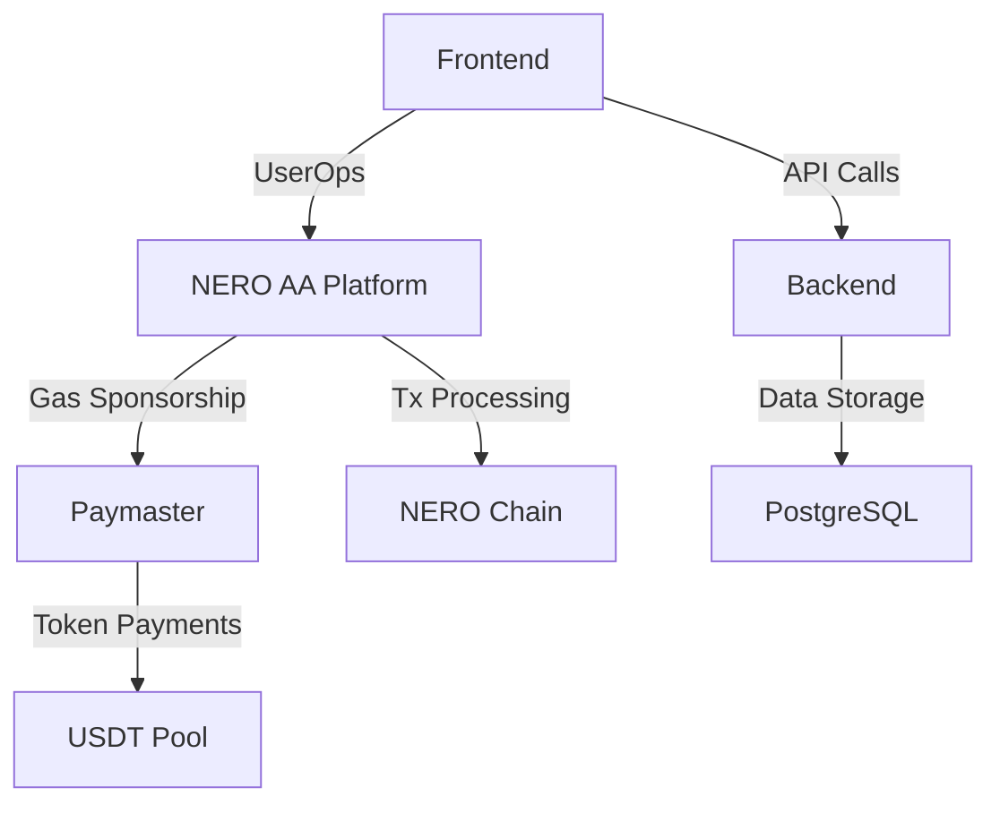

Here's your enhanced README.md that better aligns with NERO Chain's WaveHack goals while maintaining all your existing functionality:

```markdown
# Nero-BaseLink: Frictionless Payments with NERO Chain

[](https://baselnk.vercel.app)
[](https://nerochain.io)

## Overview

Nero-BaseLink is a DeFi payment solution leveraging NERO Chain's Account Abstraction to enable gasless USDT payment links with smart wallet onboarding. Businesses can create trackable payment links while abstracting away Web3 complexity.

## Key Features

✨ **NERO Chain Integration**
- Paymaster-powered gasless transactions
- Smart wallet auto-creation for first-time users
- Pay gas fees in USDT instead of native tokens

🛒 **Business-Friendly Tools**
- One-click payment link generation
- Integrated inventory tracking
- Cross-border payment processing

🔗 **Web2-Like Experience**
- No seed phrases required
- Email notification options
- Familiar checkout flow

## Problem Solved

Social sellers and digital creators face three core challenges:
1. **Payment Friction**: Long wallet addresses cause errors
2. **Gas Complexity**: Users abandon transactions due to gas confusion
3. **Inventory Management**: No integrated tracking for crypto payments

## NERO-Powered Solution

BaseLink solves these using NERO Chain's capabilities:

| Problem | Solution | NERO Feature Used |
|---------|----------|-------------------|
| Wallet complexity | Smart wallet onboarding | Account Abstraction |
| Gas confusion | Sponsored transactions | Paymaster |
| Multi-step payments | Batch operations | UserOpSDK |
| High fees | Token-as-gas payments | Flexible Gas Logic |

## Live Demo

➡️ [Experience Nero-BaseLink](https://baselnk.vercel.app)

Try these test flows:
1. **First-time user** - Automatic smart wallet creation
2. **Seller dashboard** - Create gas-sponsored payment links
3. **Buyer flow** - Pay with USDT (covers gas automatically)

## Technical Architecture



**Key Components:**
1. **AA Frontend**: Next.js interface with NERO Wallet SDK
2. **Paymaster Rules**: Dynamic gas sponsorship logic
3. **Batch Processor**: Combines payments + inventory updates
4. **Smart Wallets**: NERO-managed AA accounts

## Tech Stack

**Blockchain Layer**
- NERO Chain (Primary)
- Base Sepolia (Fallback)
- NERO AA Platform (Paymaster, UserOpSDK)

**Frontend**
- Next.js 14
- NERO Wallet SDK
- Tailwind CSS

**Backend**
- Node.js
- PostgreSQL
- Prisma ORM

**Smart Contracts**
- Payment Link Factory (NERO Chain)
- Inventory Manager (Base Sepolia)

## Roadmap

### Wave 2 Goals (0-2 months)
- [x] NERO Paymaster integration
- [x] Smart wallet auto-onboarding
- [ ] Multi-token gas payments
- [ ] Batch transaction processing

### Post-Hackathon (3-6 months)
- [ ] NERO Chain reputation system
- [ ] Mobile PWA with deep linking
- [ ] Cross-chain expansion
- [ ] Plug-and-play marketplace

## Screenshots


*NERO Chain benefits highlighted*


*Payment link management with gas sponsorship options*


*Gasless checkout experience*

## Getting Started

1. Clone repo
```bash
git clone https://github.com/your-repo/nero-baselink.git
```

2. Install dependencies
```bash
yarn install
```

3. Set up environment variables
```bash
cp .env.example .env.local
```

4. Run development server
```bash
yarn dev
```

## Judges' Notes

This submission specifically addresses Wave 2 criteria by:
- Deeply integrating NERO's AA platform features
- Providing clear technical architecture
- Demonstrating executable roadmap
- Focusing on mass adoption through UX


## BaseLink Overview

Nero-BaseLink is a DeFi payment solution leveraging NERO Chain's Account Abstraction to enable gasless USDT payment links with smart wallet onboarding. Businesses can create trackable payment links while abstracting away Web3 complexity.

## Problem

Currently, social media-based business owners face significant barriers in receiving international payments. While they can easily market their products globally, converting international interest into actual sales remains a challenge. They can share long wallet addresses to receive payments but this is prone to typo error. This approach is also inconvenient for users or small businesses who want to track payments and inventory.

## Solution

BaseLink lets users create listings, share links, and receive USDT payments directly to their wallet. It's great for small businesses, donations, and community contributions. BaseLink has the benefits of:

- Eliminating error with long wallet addresses
- Enables cross border payments
- Inventory management

## Demo & Transaction

- [Live Dapp](https://baselnk.vercel.app)

## Tech Stack

- **Backend**: Solidity, Remix, PostgreSql

- **Frontend**: NextJs, Wagmi library, Base smart wallet for blockchain interaction

- **Approach**: Associate listings with smart wallet addresses on smart contract. Facilitate payments via smart contract on BASE(Sepolia) blockchain for speed, and gas free!

## Road Map (v0.0.1)

- incorporate sponsored gas for managing listings on mainnet

- make payments (approval and transfer) one click

- Add optional email notification on received payments

- Add Images and videos to listings

- Add public listing page for verified social media businesses (Marketplace)


## Previews


